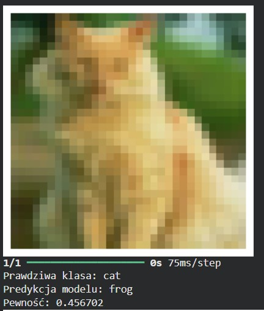
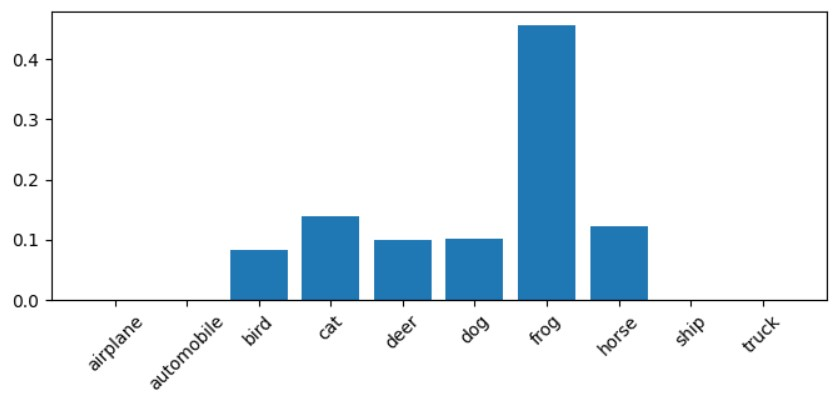
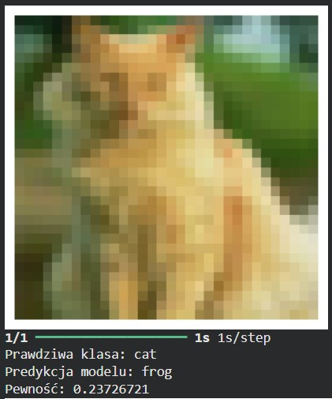
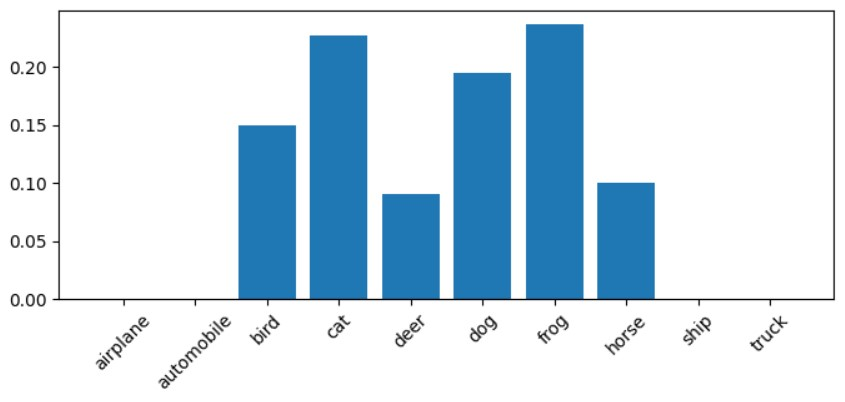
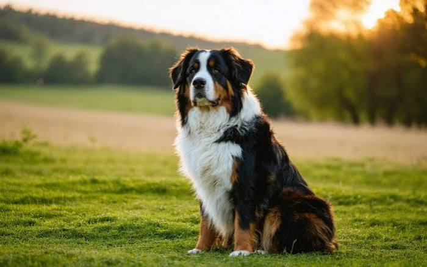
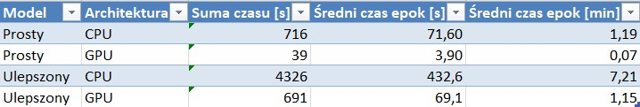
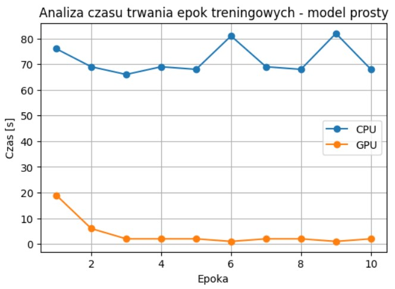
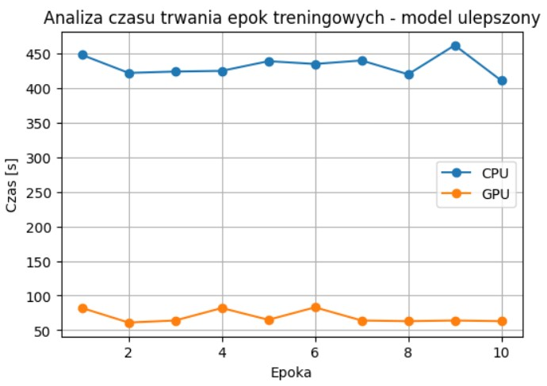
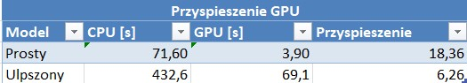

## Image-Classification-CIFAR-10-CNN-and-Transfer-Learning
Celem projektu było zaprojektowanie, implementacja oraz porównanie różnych podejść do klasyfikacji obrazów w zadaniu wieloklasowym na zbiorze CIFAR-10. Głównym założeniem było sprawdzenie:
- jak zmienia się skuteczność modeli wraz z ich złożonością,
- jaki wpływ ma augmentacja danych na jakość uczenia,
- jak transfer learning wypada względem klasycznych sieci CNN,
- jak różni się czas uczenia modeli na CPU i GPU.

Projekt ma charakter eksperymentalny i porównawczy.

Wykorzystano publiczny zbiór CIFAR-10, który zawiera 60 000 kolorowych obrazów (32x32 px), podzielonych na 50 000 próbek treningowych, 10 000 próbek testowych. 10 klas obiektów: airplane, automobile, bird, cat, deer, dog, frog,
horse, ship, truck.

### Przygotowanie danych
Dane zostały znormalizowane, czyli skalowanie wartości pikseli do zakresu 0-1, zakodowane one-hot encodingiem dla funkcji categorical_crossentropy, przekształcone do odpowiedniego formatu wejściowego dla sieci CNN.

## 1. Model CNN - wersja podstawowa
### Architektura CPU
Pierwszy model był klasyczną siecią konwolucyjną, zawierającą warstwy Conv2D, MaxPooling, Flatten, warstwy Dense, Dropout. Model był trenowany na CPU i GPU bez zaawansowanych technik optymalizacji.

Dokładność testowa wyniosła około 64%, a błąd loss 1.03. 

Przykładowa predykcja

*Rys. 1. Przykładowe wczytane do pliku zdjęcie - kot.*

Dla przedstawionej ilustracji model przewidział klase 'deer', co nie do końca ilustruje rzeczywisty obiekt. Prawdopodobieństwa klas: deer - 33.85 %, bird - 17.61 %, horse - 14.16 %, cat - 11.16 %, airplane - 8.8 %.

### Architektura GPU
Dokładność testowa dla GPU wyniosła około 63.6%, a błąd loss 1.03. Prosty model CNN osiągnął dokładność testową około 63.6%, co oznacza, że poprawnie klasyfikuje nieco ponad połowę obrazów, ale ma ograniczoną zdolność rozróżniania podobnych klas.

## 2. Model CNN - wersja ulepszona
### Architektura CPU
Druga architektura została rozszerzona o BatchNormalization, data augmentation, większą liczbę filtrów, optymalizator Adam z niższym learning rate, Dropout w wielu warstwach.
Efektem tego była lepsza generalizacja, wyższa stabilność treningu, dokładność testowa wynosząca około 68%. Model nadal był uczony od zera, ale był bardziej odporny na overfitting.
Podsumowując, ulepszony CNN jest wyraźnym krokiem naprzód względem prostego modelu, jednak nadal znajduje się w typowym zakresie skuteczności dla własnych sieci uczonych od zera. 
Ograniczenia wynikają głównie z architektury oraz braku wykorzystania GPU, który w praktyce pozwala znacznie szybciej testować i rozwijać modele.

Przykładowa predykcja

*Rys. 2. Przykładowe zdjęcie ze zbioru test wraz z predykcją - kot.*

*Rys. 3. Prawdopodobieństwa klas przwidziane przez model.*

Model w tym wypadku przewidział klase 'frog', co nie odpowiada rzeczywistej klasy. Pewność wyniosła 0.45.

### Architektura GPU
Ulepszony model CNN dla architektury GPU osiągnął wyraźnie lepszy wynik około 71.3% dokładności, a błąd wyniosł 0.82. Model wykazywał lepszą zdolność generalizacji w porównaniu do wersji CPU, co wynikało zarówno z szybszego treningu, jak i możliwości częstszego aktualizowania wag w krótszym czasie.

Dla tego samego przykłądu, model jednak wskazał tą samą klasę co poprzednio, jednak pewność dla tej klasy zmalała do 0.23.

*Rys. 4. Przykładowe zdjęcie ze zbioru test wraz z predykcją dla GPU - kot.*

*Rys. 5. Prawdopodobieństwa klas przwidziane przez model.*

Przykładowa predykcja

*Rys. 6. Przykładowe wczytane do pliku zdjęcie - pies.*

Dla przedstawionej ilustracji model przewidział klase 'horse', co nie do końca ilustruje rzeczywisty obiekt dla klasy 'pies'. Prawdopodobieństwa klas: horse - 45.75 %, dog - 20.32 %, bird - 11.91 %, deer - 5.13 %, truck - 4.98 %.

## 3. Model Transfer Learning - MobileNetV2
W zastosowanym podejściu wykorzystano transfer learning z gotowego modelu MobileNetV2. Model bazowy został zamrożony trainable = False, a na jego wyjściu dodano własne warstwy GlobalAveragePooling, Dense, Dropout, Dense softmax.
Zdjęcia zostały przeskalowane do rozmiaru 96x96, co pozwalało dopasować je do wymagań modelu.

Model osiągnął znacznie wyższą dokładność 81.6% niż wcześniejsze modele CNN ~63-71%. Już od pierwszej epoki osiąga wysokie wartości, co pokazuje skuteczność transfer learning. Krzywa uczenia jest stabilna,
brak dużego overfittingu. Model szybko konwerguje, ponieważ MobileNetV2 ma już wyuczone cechy takie jak krawędzie, tekstury, struktury, uczona jest tylko końcowa warstwa klasyfikacyjna.

Dla tego samego przykładu klasy 'pies' model TL wkazał poprawną etykietę z prawdopodobieństwem 81.82 %, a pozostałe klasy typował tak: cat - 7.58 %, bird - 7.47 %, horse - 2.32 %, truck - 0.37 %.

Transfer learning znacząco poprawił jakość klasyfikacji w porównaniu do modeli budowanych od zera.

## Porównanie CPU vs GPU
W przypadku modeli CNN uczonych od podstaw, różnica pomiędzy architekturą CPU i GPU była bardzo wyraźna zarówno pod względem czasu treningu, jak i stabilności uczenia.

Dla architektury CPU trening modeli był znacząco wolniejszy:
- CNN prosty: ~60-80 sekund na epokę
- CNN ulepszony: nawet ~350-450 sekund na epokę
- pełny trening 10 epok trwał kilkadziesiąt minut

Na GPU czas uczenia został znacząco skrócony:
- CNN prosty: ~1-3 sekundy na epokę
- CNN ulepszony: ~60-80 sekund na epokę

*Rys. 7. Tabela ukazująca sume i średni czas trwania epok dla CPU i GPU.*

*Rys. 8. Wykress przedstawiający porównanie CPU vs GPU.*

*Rys. 9. Wykres przedstawiający czas trwania epok modelu prostego dla CPU i GPU.*

*Rys. 10. Wykres przedstawiający czas trwania epok modelu ulepszonego dla CPU i GPU.*

### Przyspieszenie GPU nad CPU
Powyższa tabela przedstawia porównanie czasu wykonania jednej epoki treningowej dla dwóch modeli na dwóch architekturach sprzętowych: CPU oraz GPU. Dodatkowo obliczono współczynnik przyspieszenia, który pokazuje, ile razy szybciej działa GPU względem CPU.

*Rys. 11. Tabela ukazuje przyspieszenie GPU nad CPU.*

- Model prosty - CPU: 71.60 s, GPU: 3.90 s, przyspieszenie: 18.36x

Oznacza to, że GPU wykonało jedną epokę około 18 razy szybciej niż CPU. W przypadku prostego modelu zysk jest bardzo duży, ponieważ operacje są lekkie i dobrze równoległe.

- Model ulepszony - CPU: 432.6 s, GPU: 69.1 s, przyspieszenie: 6.26x

Tutaj również GPU jest znacząco szybsze, jednak przyspieszenie jest mniejsze niż w modelu prostym. Może wynikać to z większej złożoności modelu, większego narzutu obliczeniowego, który nie skaluje się idealnie równolegle.

Transfer Learning - CPU vs GPU
- Dla architektury CPU TL jedna epoka trwała ponad 1 godzinę, co oznaczało, że trening był praktycznie nieefektywny czasowo. Dlatego była ograniczona możliwość testowania wielu epok.
- Natomiast wersja GPU znacząco przyspieszyła ten proces. Epoka trwała średnio 10-45 sekund. Model szybko osiągał wysoką skuteczność ~78-80%. Cały trening 10 epok był możliwy w kilka minut

Podsumowanie

GPU nie tylko przyspiesza eksperymenty, ale wręcz umożliwia praktyczne wykorzystanie transfer learning, który na CPU byłby zbyt czasochłonny do sensownego trenowania.
GPU zawsze znacząco przyspiesza trening modeli CNN. Największy zysk widać w prostszych modelach ponad 18x. W bardziej złożonych modelach przyspieszenie jest mniejsze, ale nadal bardzo istotne 6x.
Różnica wynika z tego, że nie wszystkie operacje w sieciach neuronowych są w pełni równoległe.

### Całościowe podsumowanie projektu
Celem projektu było zaprojektowanie, implementacja oraz porównanie różnych podejść do klasyfikacji obrazów na zbiorze CIFAR-10, obejmujących zarówno klasyczne sieci konwolucyjne, 
jak i nowoczesne podejście oparte na transfer learning. Dodatkowo przeprowadzono analizę wpływu sprzętu obliczeniowego CPU vs GPU na czas uczenia oraz efektywność modeli.

Z przeprowadzonych eksperymentów wynikają następujące wnioski:
- zwiększanie złożoności modelu CNN poprawia wyniki, ale tylko do pewnego poziomu,
- data augmentation i BatchNormalization poprawiają stabilność uczenia,
- transfer learning zapewnia największy skok jakościowy,
- GPU nie zmienia jakości modeli, ale radykalnie skraca czas eksperymentów,
- CPU ogranicza możliwość praktycznego trenowania bardziej zaawansowanych modeli.

Najlepszy uzyskany model MobileNetV2 osiągnął około 81% accuracy, stabilne uczenie bez overfittingu, najlepszą jakość predykcji spośród wszystkich testowanych modeli.
